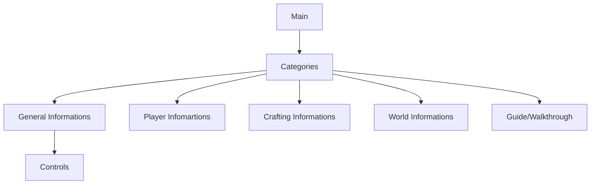

# Monster Hunter World Wiki Application

## Information

> The application contain some tips for helping player when play the MHW game.

## Project structure
```
├───lib
│   ├───configs
│   ├───images
│   ├───models
│   ├───utils
│   ├───views
│   └───widgets
```
### Config
- contain all application configs:
    - database_name
### Images
- contain all media files (image, gif, video...)
### Models
- Define all models for application
    - lib : 
        - build_runner
        - json_serializable
### Utils
- Define all variable, method, class or action that can reused anywhere (global)
### Views
- Define all screen for application
### Widgets
- Define all common widget that has been used somewhere by any screen

## Application Views Structure
